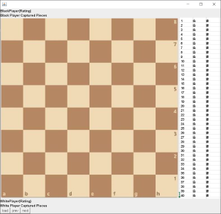
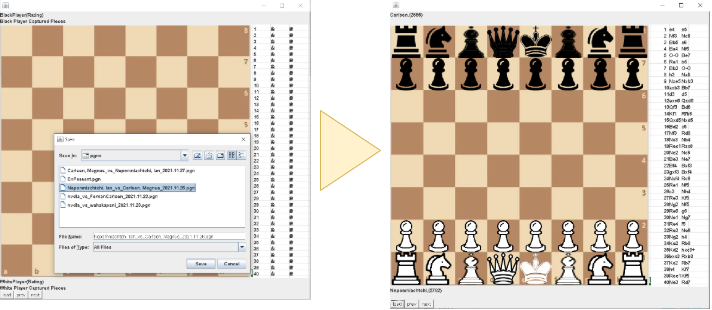
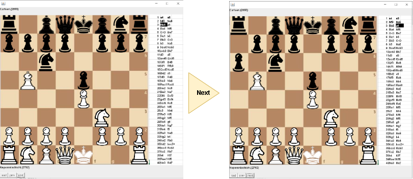

# Chess Simulator
* presentation : https://www.youtube.com/watch?v=maWFrHqbrDU

### How to Run & Use
* run App.java

* Click Load button and Load pgn file

* Click Next Button and Enjoy Review Your Chess Games

Ruy Lopez

### Not Implemented Functions
* prev button
* display captured pieces

